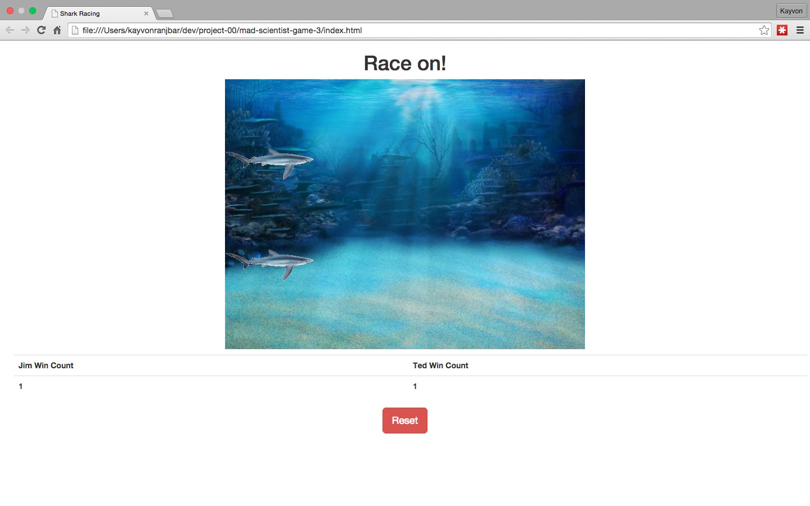

# Shark Racing Game

*The goal of the project is to build a racing game using HTML, CSS, and JavaScript/jQuery that is responsive to the keyboard. The main functionality is 2 user players racing across a game board.*

## Technologies Used

*HTML*
*CSS*
*JavaScript*
*jQuery*

## Existing Features

*2 user players with respective controls (press "f" to move player 1, "j" to move player 2*
*Name of round winner displayed and win count stored*
*Gameboard able to be reset*

## Planned Features

*Additional styling using CSS animations*
*Countdown timer*
*Integration with Shark youtube video API at end of each round*

---

##### Screenshot (optional)

##### Link to hosted project on GitHub pages or BitBalloon (optional)

http://kranjbar.github.io/